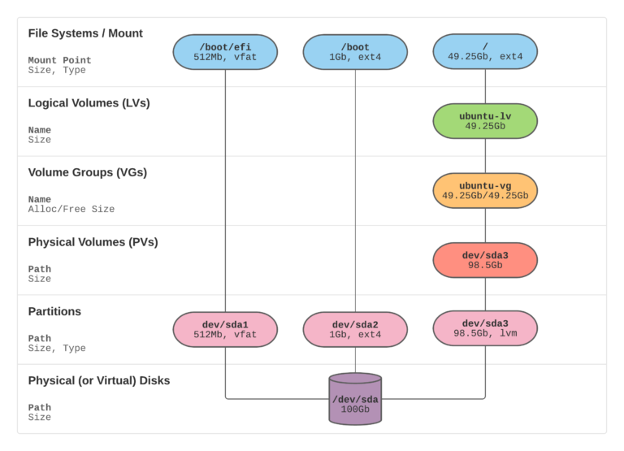

Ada kasus, logical volume yang diassign terlalu sedikit, sementara kapasitas pada volume group masih ada yang bisa digunakan.



1. Check kapasitas filesystem yang ada
```
# df -h
Filesystem                         Size  Used Avail Use% Mounted on
udev                                63G     0   63G   0% /dev
tmpfs                               13G  2.8M   13G   1% /run
/dev/mapper/ubuntu--vg-ubuntu--lv   98G   25G   69G  27% /
tmpfs                               63G     0   63G   0% /dev/shm
```
Terlihat kapasitas root (/) sekitar 98G dengan menggunakan ubuntu--vg-ubuntu--lv

2. Check kapasitas logical volume
```
# sudo lvdisplay
  --- Logical volume ---
  LV Path                /dev/ubuntu-vg/ubuntu-lv
  LV Name                ubuntu-lv
  VG Name                ubuntu-vg
  LV UUID                0bK6YR-BQz9-T2Vn-lsjE-VFq9-6NBS-UXKdSC
  LV Write Access        read/write
  LV Creation host, time ubuntu-server, 2022-03-14 07:45:20 +0000
  LV Status              available
  # open                 1
  LV Size                100.00 GiB
  Current LE             25600
  Segments               1
  Allocation             inherit
  Read ahead sectors     auto
  - currently set to     256
  Block device           253:0
```
Terlihat LV Size : 100 GiB


3. Check volume group
```
# sudo vgdisplay
  --- Volume group ---
  VG Name               ubuntu-vg
  System ID
  Format                lvm2
  Metadata Areas        1
  Metadata Sequence No  2
  VG Access             read/write
  VG Status             resizable
  MAX LV                0
  Cur LV                1
  Open LV               1
  Max PV                0
  Cur PV                1
  Act PV                1
  VG Size               <474.39 GiB
  PE Size               4.00 MiB
  Total PE              121443
  Alloc PE / Size       25600 / 100.00 GiB
  Free  PE / Size       95843 / <374.39 GiB
  VG UUID               Id7DBZ-xiHW-thfn-mELz-Y0va-Ytap-uCykhI

```
Terlihat VG Size menunjukkan 474.39 GiB, dan free PE/Sise : 95843 / <374.39 GiB. Artinya masih ada 374.39 GiB yang dapat digunakan.

4. Extend kapasitas /dev/ubuntu-vg/ubuntu-lv ke 100%
```
lvextend -l +100%FREE /dev/ubuntu-vg/ubuntu-lv
```

5. Check kembali logical volume
```
sudo lvdisplay
  --- Logical volume ---
  LV Path                /dev/ubuntu-vg/ubuntu-lv
  LV Name                ubuntu-lv
  VG Name                ubuntu-vg
  LV UUID                0bK6YR-BQz9-T2Vn-lsjE-VFq9-6NBS-UXKdSC
  LV Write Access        read/write
  LV Creation host, time ubuntu-server, 2022-03-14 07:45:20 +0000
  LV Status              available
  # open                 1
  LV Size                <474.39 GiB
  Current LE             121443
  Segments               1
  Allocation             inherit
  Read ahead sectors     auto
  - currently set to     256
  Block device           253:0
```
Terlihar LV Size <474.39 GiB.


7.  Extend filesystem
```
# sudo resize2fs /dev/mapper/ubuntu--vg-ubuntu--lv
```

8. Check kembali kapasitas filesystem
```
# df -h
Filesystem                         Size  Used Avail Use% Mounted on
udev                                63G     0   63G   0% /dev
tmpfs                               13G  2.8M   13G   1% /run
/dev/mapper/ubuntu--vg-ubuntu--lv  467G   25G  422G   6% /
tmpfs                               63G     0   63G   0% /dev/shm
```

